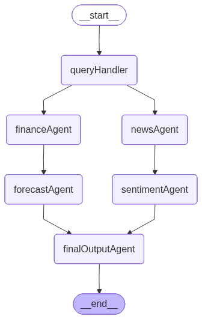

**Project Name:** StockSentry
**Hackathon:** *Online Hackathon 29.2 by Flipr*
**Team Project:** StockSentry – Multi-Agent AI-driven Financial Analysis and Forecasting System
**Team Name:** Sigan

# StockSentry: Multi-Agent AI Financial Intelligence System

**StockSentry** is an **AI-driven multi-agent stock analysis system** that autonomously performs **fundamental analysis**, **news sentiment evaluation**, and **price forecasting** using **ARIMA** and **LSTM** models.
Built on **LangGraph**, it combines **live financial data**, **RoBERTa sentiment analysis**, and **Hugging Face forecasting**, powered by a **FastAPI backend** and **EJS frontend**, deployed on **Render**.

## Key Features: Multi-Agent Financial Intelligence System

* **LangGraph Multi-Agent Workflow:** Modular, autonomous agents for finance, news, forecasting, and sentiment.
* **Dual Forecast Models (ARIMA + LSTM):** Combines classical time-series forecasting with AI-powered trend prediction.
* **Fundamental Analysis:** Extracts EPS, P/E Ratio, Debt-to-Equity, Revenue, Profit, and Profit Margin trends.
* **News Sentiment Analysis (RoBERTa):** Fine-tuned transformer-based NLP model for nuanced tone detection and confidence scoring.
* **Intelligent Title Inference:** Infers sentiment from news titles when article text is unavailable.
* **Hybrid Forecast Visualization:** Displays both ARIMA and LSTM forecasts side-by-side via dynamic charting.
* **AI-Generated Market Intelligence Report:** Synthesizes all agent data into a comprehensive markdown report with verdict (🟢 Bullish / 🔴 Bearish).
* **Full-Stack Implementation:** Backend: FastAPI (Python); Frontend: EJS + Express (Node.js).
* **Cloud-Native Deployment:** Hosted on Render, with built-in health checks and frontend wake-up pings for backend uptime.

## Architecture Overview

### Multi-Agent Workflow (LangGraph)



### LSTM Forecasting Model Performance

Below are the evaluation metrics for the **LSTM-based stock price forecasting model** used within **StockSentry**, tested on multiple large-cap tickers:

| **Ticker** | **RMSE** | **MAE** | **R² Score** |
| ---------------- | -------------- | ------------- | ------------------- |
| **AAPL**   | 4.49           | 3.54          | 0.82                |
| **MSFT**   | 9.07           | 7.30          | 0.63                |
| **GOOGL**  | 4.84           | 3.72          | 0.82                |
| **AMZN**   | 6.26           | 4.81          | 0.87                |
| **META**   | 8.92           | 6.74          | 0.90                |

---

## Steps to Run Locally

### 1. Clone the Repository

```bash
git clone https://github.com/Zapmasterzeus/StockSentry.git
cd StockSentry
```

---

### 2. Start the Backend (FastAPI + LangGraph Agents)

```bash
cd backend
pip install -r requirements.txt
```

Then launch the backend server using **Uvicorn**:

```bash
uvicorn main:app --host 0.0.0.0 --port 8000 --reload
```

### 3. Start the Frontend (EJS + Express)

In a **new terminal window**:

```bash
cd frontend
npm install
npm start
```

The frontend will start at:
👉 [http://localhost:3000](http://localhost:3000)

### 4. Environment files required

```bash
cd backend
type nul > .env
on windows
touch .env
on ubuntu
```

### Contents of .env file

```bash
# Set to "True" if using Google Vertex AI, otherwise "False"
GOOGLE_GENAI_USE_VERTEXAI=

# API key for Google Generative AI (Gemini API)
GOOGLE_API_KEY=

# API key for SerpAPI (used for search integrations)
SERPAPI_KEY=

# API key for Hugging Face (for model inference or embeddings)
HUGGINGFACE_API_KEY=
```


## Live Demo (Hosted on Render)

You can explore the deployed version of **StockSentry** here:

[https://stocksentry-frontend.onrender.com/](https://stocksentry-frontend.onrender.com/)

## Summary

**StockSentry** is an intelligent, multi-agent financial analysis platform that combines **AI forecasting**, **NLP sentiment analysis**, and **real-time news aggregation** to deliver comprehensive investment insights.

Built using **LangGraph**, **FastAPI**, and **EJS**, the system automatically fetches market data, predicts short-term stock trends using **ARIMA and LSTM models**, and evaluates investor sentiment through a **RoBERTa-based sentiment engine**.
It then generates a professional-grade **Market Intelligence Report**, complete with visual forecasts and valuation insights.

---

## Future Enhancements

Planned improvements include:

* **Agentic Reinforcement Loop:** Continuous fine-tuning of LSTM and sentiment agents based on real-time feedback.
* **Live Market Integration:** Stream stock price updates via APIs like Yahoo Finance or Alpha Vantage.
* **Portfolio Analysis Agent:** Multi-ticker analysis with diversification insights and portfolio optimization.
* **Advanced News Summarization:** Integrate transformer-based abstractive summarizers for cleaner article insights.
* **User Dashboard:** Personalized reports, saved analyses, and watchlist tracking for registered users.
* **Deployment Upgrade:** Move to a persistent Render or Fly.io plan to eliminate cold start delays.

---

## ⚠️ Note

> **⏳ The hosted version may take 30–60 seconds to load initially**,
> as both the backend (FastAPI + LangGraph) and frontend (Node + EJS) are deployed on **Render’s free tier**, which sleeps when inactive.
> After the first request, all subsequent interactions run smoothly.

---
